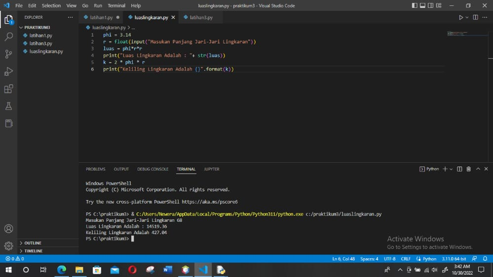

# Praktikum3

## Flowchart Menghitung Luas dan Keliling Lingkaran

Kemudian kita menuliskan kode programnya di PyCharm dengan hasil sebagai berikut :

Keterangan :
phi = 3.14
r = float(input("masukan panjang jari-jari lingkaran"))
luas = phi*r*r
print("luas lingkaran adalah : "+ str(luas))
k = 2 * phi * r
print("keliling lingkaran adalah {}".format(k))

Baris 1 : mendeklarasikan variable phi dengan nilai 3.14 
Baris 2 : mendeklarasikan variable r serta memasukkan nilai jari-jari lingkaran bertipe float yang didapat dari user. 
Baris 3 : mendeklarasikan variable luas dimana nilai variable tersebut didapat dari perhitungan luas, dimana nilai variable phi dikali nilai variable r lalu dikali dengan variable r dan hasilnya akan dimasukkan kedalam variable luas. 
Baris 4 : menampilkan nilai dari variable luas. 
Baris 5 : perhitungan keliling dimana dua dikali dengan nilai variable phi dikali nilai variable r dan hasilnya akan dimasukkan kedalam variable k. 
Baris 6 : menampilkan nilai dari variable k.

## Latihan 3

Keterangan :
print('{0:>20}'.format('*'))
print('{0:>21}'.format('***'))
print('{0:>22}'.format('*****'))
print('{0:>23}'.format('*******'))
print('{0:>24}'.format('*********'))
print('{0:>23}'.format('*******'))
print('{0:>22}'.format('*****'))
print('{0:>21}'.format('***'))
print('{0:>20}'.format('*'))